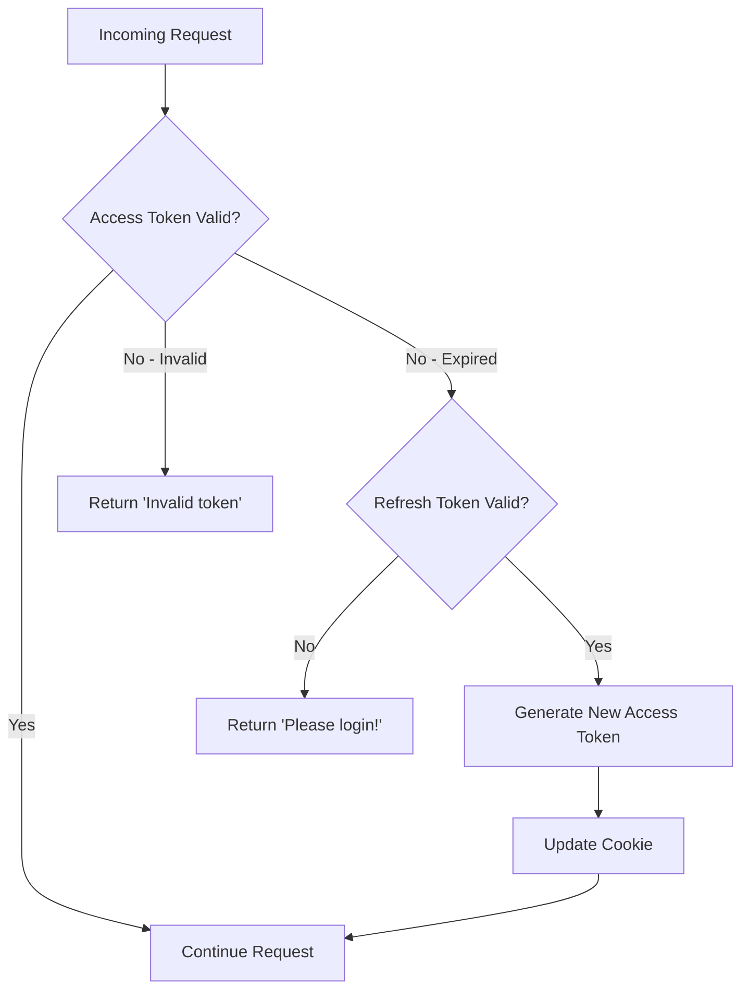
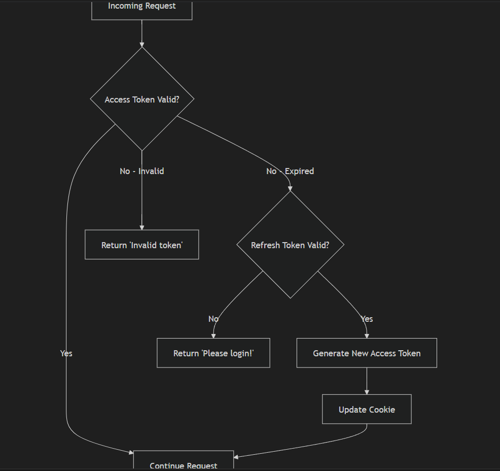

# Token Refresh Logic Implementation - Walkthrough

## Overview

Successfully implemented a comprehensive token refresh mechanism that automatically renews expired access tokens using valid refresh tokens, providing seamless authentication without forcing users to re-login unnecessarily.

## Implementation Summary

### 1. JWT Verification Utilities

**File**: [jwt.util.ts](file:///d:/project%20for%20internship/saas_product/hospital_management_system/hospital_management_system/backend/src/utils/jwt.util.ts)

Added two new verification functions:

```typescript
export const verifyAccessToken = (token: string) => {
    try {
        return jwt.verify(token, ACCESS_SECRET);
    } catch (error: any) {
        throw new Error(error.message);
    }
};

export const verifyRefreshToken = (token: string) => {
    try {
        return jwt.verify(token, REFRESH_SECRET);
    } catch (error: any) {
        throw new Error(error.message);
    }
};
```

These functions validate JWT signatures and expiration times, throwing descriptive errors for invalid or expired tokens.

---

### 2. Auth Service Enhancements

**File**: [auth.service.ts](file:///d:/project%20for%20internship/saas_product/hospital_management_system/hospital_management_system/backend/src/services/auth.service.ts)

#### Refresh Token Storage

Updated the `login` method to store refresh tokens in the database for tenant users:

```typescript
// Store refresh token in database for tenant users
await tenantPrisma.refreshToken.create({
  data: {
    userId: user.id,
    token: token.refreshToken,
  },
});
```

> [!NOTE]
> Super admin refresh tokens are **not** stored in the database since the `RefreshToken` model only exists in tenant schemas. Super admin tokens are validated purely by JWT signature.

#### Token Refresh Logic

Added `refreshAccessToken` method that:

1. **Verifies the refresh token** using JWT verification
2. **Handles Super Admin** - Generates new access token directly
3. **Handles Tenant Users** - Validates token exists in database before generating new access token
4. **Returns "Please login!"** when refresh token is expired

```typescript
async refreshAccessToken(refreshToken: string) {
  try {
    const decoded = verifyRefreshToken(refreshToken) as any;

    // Super admin path
    if (decoded.role === "SUPER_ADMIN") {
      const payload = { id: decoded.id, email: decoded.email, role: decoded.role };
      const newAccessToken = await generateAccessToken(payload);
      return { accessToken: newAccessToken, user: payload };
    }

    // Tenant user path - verify token in database
    if (decoded.tenantId) {
      const storedToken = await tenantPrisma.refreshToken.findFirst({
        where: { userId: decoded.id, token: refreshToken }
      });

      if (!storedToken) {
        throw new Error("Invalid refresh token");
      }
      
      // Generate new access token
      const payload = { id: decoded.id, email: decoded.email, role: decoded.role, tenantId: decoded.tenantId };
      const newAccessToken = await generateAccessToken(payload);
      return { accessToken: newAccessToken, user: payload };
    }

    throw new Error("Invalid token payload");
  } catch (error: any) {
    if (error.message.includes("jwt expired")) {
      throw new Error("Please login!");
    }
    throw error;
  }
}
```

---

### 3. Refresh Token Endpoint

**File**: [auth.controller.ts](file:///d:/project%20for%20internship/saas_product/hospital_management_system/hospital_management_system/backend/src/controllers/auth.controller.ts)

Completed the `/api/auth/refresh` endpoint:

```typescript
refreshToken = async (req: AuthRequest, res: Response) => {
    const refreshToken = req.cookies.refresh_token;
    
    if (!refreshToken) {
        return res.status(401).json({
            success: false,
            message: "Please login!"
        });
    }

    const result = await this.authService.refreshAccessToken(refreshToken);

    res
        .cookie("access_token", result.accessToken, {
            httpOnly: true,
            secure: process.env.NODE_ENV === "production",
            sameSite: "strict",
            maxAge: 15 * 60 * 1000
        })
        .status(200).json({
            success: true,
            message: "Token refreshed successfully",
            data: {
                accessToken: result.accessToken,
                user: result.user
            }
        });
};
```

**Endpoint**: `POST /api/auth/refresh`

**Response when successful**:
```json
{
  "success": true,
  "message": "Token refreshed successfully",
  "data": {
    "accessToken": "new.jwt.token",
    "user": { "id": "...", "email": "...", "role": "..." }
  }
}
```

**Response when both tokens expired**:
```json
{
  "success": false,
  "message": "Please login!"
}
```

---

### 4. Automatic Token Refresh Middleware

**File**: [auth.middleware.ts](file:///d:/project%20for%20internship/saas_product/hospital_management_system/hospital_management_system/backend/src/middlewares/auth.middleware.ts)

Enhanced the authentication middleware with automatic token refresh:

#### Flow Diagram



#### Key Features

1. **Try Access Token First** - Attempts to verify the access token
2. **Auto-Refresh on Expiry** - If access token is expired but refresh token is valid:
   - Generates new access token
   - Updates the cookie
   - Continues the request seamlessly
3. **Force Re-login** - Returns "Please login!" when both tokens are expired
4. **Role Validation** - Checks user roles at both token verification stages

> [!IMPORTANT]
> The middleware provides a **seamless user experience** by automatically refreshing tokens in the background. Users never see authentication errors as long as their refresh token is valid.

---

## Token Expiration Times

- **Access Token**: 15 minutes
- **Refresh Token**: 7 days

## Usage Examples

### Scenario 1: Access Token Expired, Refresh Token Valid

**What happens**:
1. User makes an API request with expired access token
2. Middleware detects expiration
3. Middleware uses refresh token to generate new access token
4. New access token is set in cookie
5. Request proceeds normally

**User experience**: Seamless - no interruption

---

### Scenario 2: Both Tokens Expired

**What happens**:
1. User makes an API request with expired access token
2. Middleware detects expiration
3. Middleware checks refresh token - also expired
4. Returns 401 with message "Please login!"

**User experience**: Must re-login

**Response**:
```json
{
  "success": false,
  "message": "Please login!"
}
```

---

### Scenario 3: Manual Token Refresh

**Request**:
```http
POST /api/auth/refresh
Cookie: refresh_token=<refresh_token>
```

**Response**:
```json
{
  "success": true,
  "message": "Token refreshed successfully",
  "data": {
    "accessToken": "new.jwt.token",
    "user": {
      "id": "user123",
      "email": "user@example.com",
      "role": "DOCTOR"
    }
  }
}
```

---

## Security Considerations

✅ **Refresh tokens stored in database** (tenant users only) - Allows revocation  
✅ **HttpOnly cookies** - Prevents XSS attacks  
✅ **Secure flag in production** - HTTPS only  
✅ **SameSite: strict** - Prevents CSRF attacks  
✅ **Role validation** - Checked at both token stages  
✅ **Database validation** - Tenant refresh tokens verified against DB

---

## Testing Recommendations

### Quick Testing (Reduce Token Expiry Temporarily)

For faster testing, temporarily modify token expiration in [jwt.util.ts](file:///d:/project%20for%20internship/saas_product/hospital_management_system/hospital_management_system/backend/src/utils/jwt.util.ts):

```typescript
// Original
generateAccessToken = async(payload:any) => {
    return await jwt.sign(payload, ACCESS_SECRET, {expiresIn:"15m"});
};

// For testing
generateAccessToken = async(payload:any) => {
    return await jwt.sign(payload, ACCESS_SECRET, {expiresIn:"30s"});
};
```

### Test Cases

1. **Login and wait for access token expiry**
   - Login as user
   - Wait 30 seconds (if using reduced expiry)
   - Make authenticated API call
   - ✅ Should succeed with new access token

2. **Login and wait for both tokens to expire**
   - Login as user
   - Wait for both to expire
   - Make authenticated API call
   - ✅ Should return "Please login!"

3. **Manual refresh endpoint**
   - Login as user
   - Call `/api/auth/refresh`
   - ✅ Should return new access token

4. **Test both user types**
   - Repeat above for super admin
   - Repeat above for tenant user
   - ✅ Both should work correctly

---

## Files Modified

| File | Changes |
|------|---------|
| [jwt.util.ts](file:///d:/project%20for%20internship/saas_product/hospital_management_system/hospital_management_system/backend/src/utils/jwt.util.ts) | Added `verifyAccessToken` and `verifyRefreshToken` functions |
| [auth.service.ts](file:///d:/project%20for%20internship/saas_product/hospital_management_system/hospital_management_system/backend/src/services/auth.service.ts) | Added `refreshAccessToken` method, updated `login` to store refresh tokens |
| [auth.controller.ts](file:///d:/project%20for%20internship/saas_product/hospital_management_system/hospital_management_system/backend/src/controllers/auth.controller.ts) | Completed `refreshToken` endpoint implementation |
| [auth.middleware.ts](file:///d:/project%20for%20internship/saas_product/hospital_management_system/hospital_management_system/backend/src/middlewares/auth.middleware.ts) | Enhanced with automatic token refresh logic |

---

## Summary

✅ **Automatic token refresh** - Users stay authenticated seamlessly  
✅ **Manual refresh endpoint** - `/api/auth/refresh` for explicit refresh  
✅ **"Please login!" message** - Clear indication when re-authentication needed  
✅ **Database-backed tokens** - Refresh tokens stored for tenant users  
✅ **Secure implementation** - HttpOnly, secure cookies with proper validation

